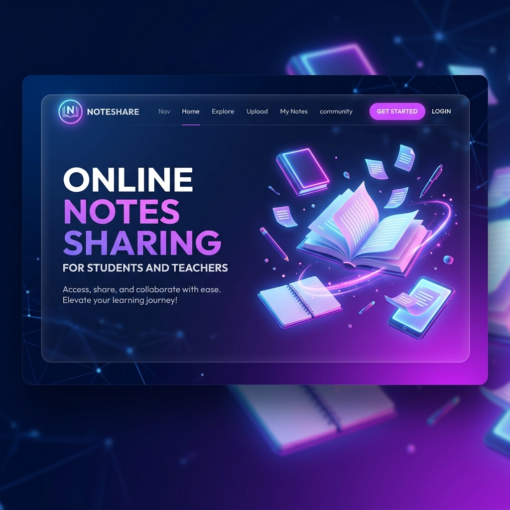
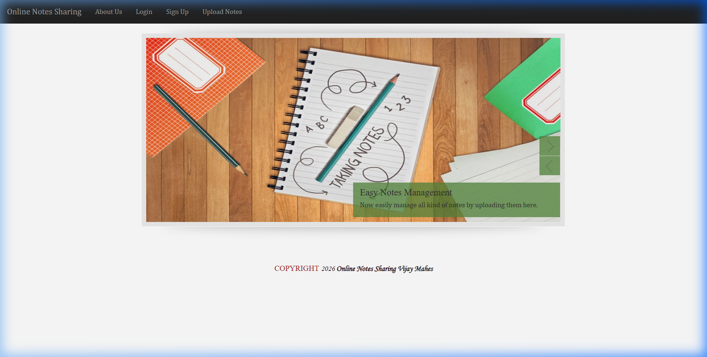
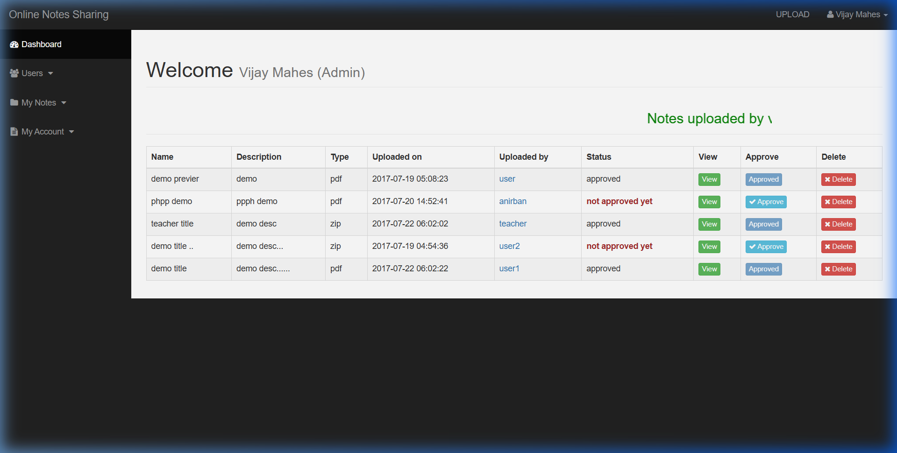

# 📚 Online Notes Sharing Platform

A modern, secure, and user-friendly notes management system developed in Core PHP and MySQLi. This platform enables students, teachers, and administrators to upload, manage, download, and share study materials seamlessly.

---

## 🎨 Visual Preview

Here is a look at the web interface of the system:

| 🏠 Homepage | 📊 Admin Dashboard |
| :---: | :---: |
|  |  |

---

## ✨ Features

- **👥 Multi-User Access Control**: Supports distinct accounts and capabilities for Admins, Teachers, and Students.
- **🛠️ Powerful Admin Panel**: Direct management of note uploads, user accounts, statuses, and logs.
- **📁 Document CRUD & Uploads**: Supports multiple file types including `.pdf`, `.ppt`, `.doc`, `.docx`, `.txt`, and `.zip` up to 30MB.
- **🔐 Secure Authentication**: Features hashed passwords (`password_hash`), query sanitizations (`mysqli_real_escape_string`), and token-based password recovery.
- **📄 Profile Customization**: Users can easily update their account information, upload bio, and change profile images.

---

## 🛠️ Technology Stack

- **Backend**: Core PHP (v5.3+)
- **Database**: MySQL / MySQLi
- **Frontend**: HTML5, CSS3, JavaScript (jQuery, Bootstrap, FlexSlider)
- **Email Service**: PHPMailer (with Gmail SMTP configuration)

---

## 🚀 Installation & Setup

1. **Clone/Copy Project**: Move the repository files to your server directory (e.g. `/var/www/html/online-notes-sharing` or your XAMPP/WAMP `htdocs` folder).
2. **Database Import**:
   - Open phpMyAdmin.
   - Create a database named `notes`.
   - Import the database dump file [notes.sql](file:///d:/BACKUP/projects/PHP%20project/online-notes-sharing/db/notes.sql).
3. **Database Configuration**:
   - Open [connection.php](file:///d:/BACKUP/projects/PHP%20project/online-notes-sharing/includes/connection.php) and update the settings to connect to your database.
4. **Launch Application**:
   - Open your browser and navigate to `http://localhost/online-notes-sharing`.

---

## 🔑 Default Login Credentials

For testing and demonstration, you can use the default accounts:

* **Admin Account**:
  - **Username**: `root`
  - **Password**: `adminroot`
* **Student/Teacher Account**:
  - **Username**: `user`
  - **Password**: `userpass`

---

## 📝 Roadmap & To-Do List

- [ ] Add note search optimization.
- [ ] Implement pagination for note tables.
- [ ] Add social authentication (Google/Facebook login).

---

## 📄 License

This project is licensed under the [MIT License](file:///d:/BACKUP/projects/PHP%20project/online-notes-sharing/LICENSE). Created & maintained by [Vijay Mahes](https://github.com/vijaymahes9080).
