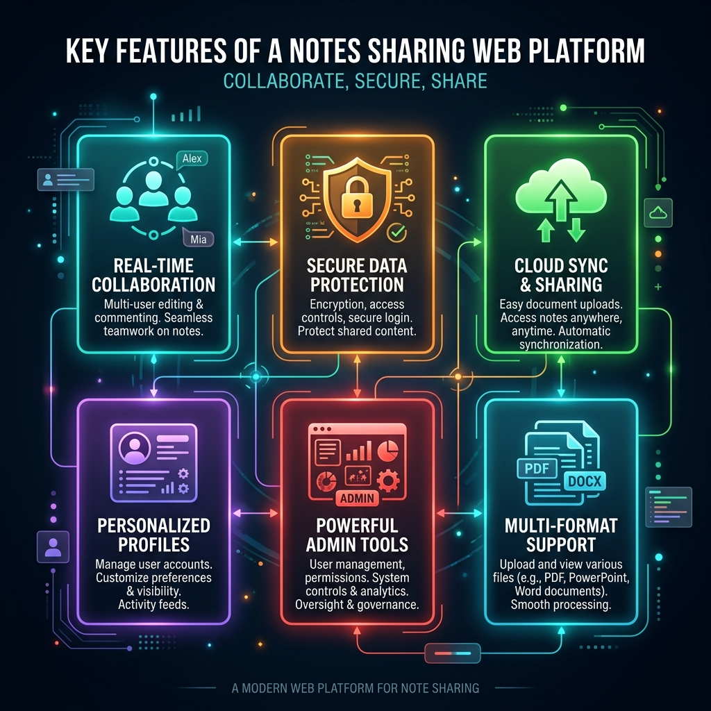
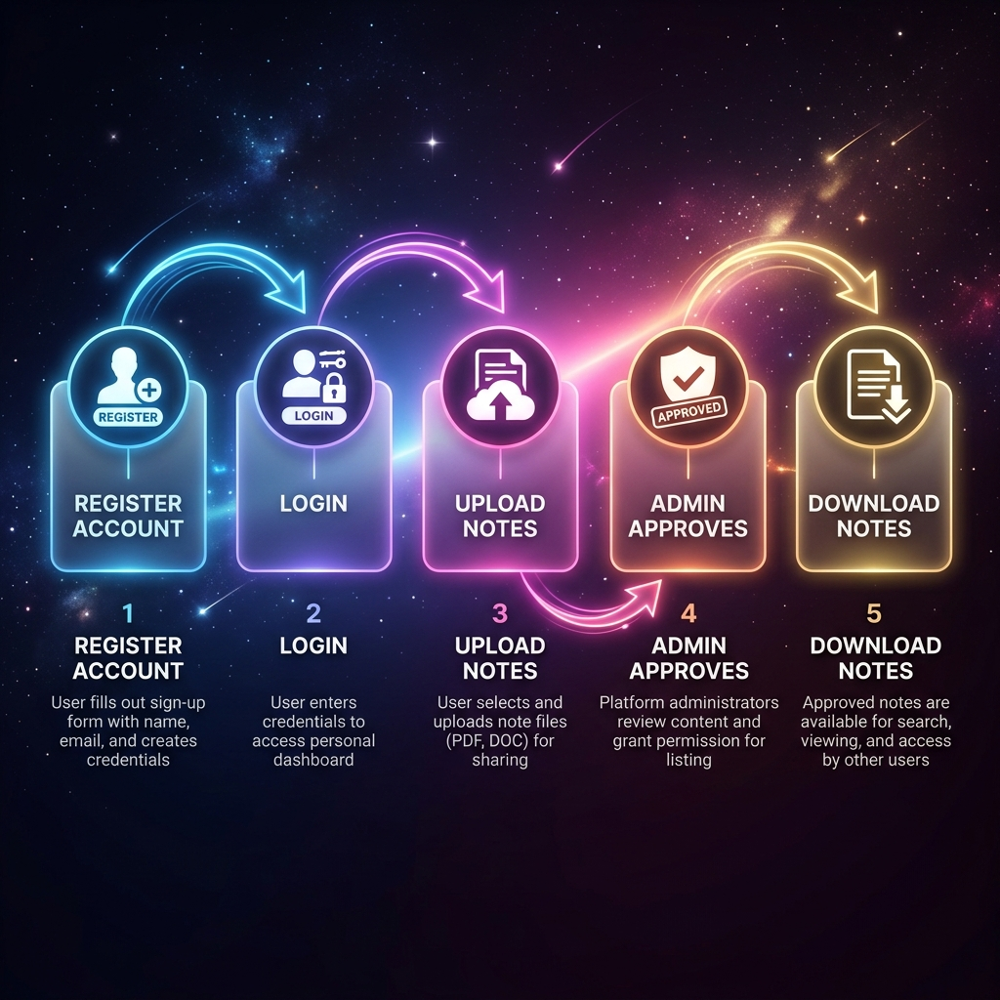

<div align="center">


# 📚 Online Notes Sharing Platform

> **A powerful, secure and multi-role notes management system built with Core PHP & MySQLi**

[](https://github.com/vijaymahes9080)
[](https://vijaymahes9080.github.io/online-notes-sharing-php/)
[](LICENSE)
[](https://www.php.net/)
[](https://www.mysql.com/)

</div>

---

## 🖥️ Live Screenshots

<table>
  <tr>
    <td align="center"><b>🏠 Homepage</b></td>
    <td align="center"><b>📊 Admin Dashboard</b></td>
  </tr>
  <tr>
    <td></td>
    <td></td>
  </tr>
</table>

---

## 👥 User Roles


This platform supports **three distinct user roles**, each with its own set of capabilities:

| Role | Description |
|------|-------------|
| 👑 **Admin** | Full system control — manage users, approve/reject notes, delete content |
| 🎓 **Teacher** | Upload course notes, manage personal uploads, update profile |
| 📖 **Student** | Browse & download approved notes from their course department |

---

## ✨ Features



- 🔐 **Secure Registration & Login** — Password hashing with `password_hash()` and safe query binding
- 📁 **Multi-format File Upload** — Supports `.pdf`, `.ppt`, `.doc`, `.docx`, `.txt`, `.zip` (up to 30MB)
- 🛡️ **Admin Approval System** — Notes go live only after admin review and approval
- 👤 **Full Profile Management** — Bio, profile photo upload, email, and password updates
- 📧 **Password Recovery via Email** — Token-based reset using PHPMailer + Gmail SMTP
- 🗂️ **Course-based Filtering** — Notes filtered by department (CS, Electrical, Mechanical)
- 📊 **Rich Admin Panel** — View, approve, or delete any upload or user account

---

## 🔄 How It Works



1. **Register** — Create an account as a Teacher or Student
2. **Login** — Authenticate and access your personal dashboard
3. **Upload** — Upload your course notes with title, description, and file
4. **Admin Reviews** — Admin approves or rejects the submission
5. **Download** — Approved students and teachers can download the note

---

## 🛠️ Technology Stack


| Layer | Technology |
|-------|------------|
| **Backend** | Core PHP 5.3+ |
| **Database** | MySQL / MySQLi |
| **Frontend** | HTML5, CSS3, Bootstrap |
| **JavaScript** | jQuery, FlexSlider |
| **Email Service** | PHPMailer (Gmail SMTP) |
| **Validation** | GUMP PHP Validation Library |

---

## 🚀 Installation & Setup

```bash
# 1. Clone this repository
git clone https://github.com/vijaymahes9080/online-notes-sharing-php.git

# 2. Move to your server's web root
#    e.g. C:/xampp/htdocs/online-notes-sharing

# 3. Import the database
#    Open phpMyAdmin → Create DB "notes" → Import db/notes.sql

# 4. Configure database connection
#    Edit includes/connection.php
```

```php
// includes/connection.php
$conn = mysqli_connect("localhost", "root", "", "notes")
        or die("error" . mysqli_error($conn));
```

```bash
# 5. Open in browser
http://localhost/online-notes-sharing
```

---

## 🔑 Default Login Credentials

| Role | Username | Password |
|------|----------|----------|
| 👑 Admin | `root` | `adminroot` |
| 📖 User | `user` | `userpass` |

---

## 📂 Project Structure

```
online-notes-sharing/
├── 📁 css/               # Stylesheets (Bootstrap, custom)
├── 📁 js/                # JavaScript files (jQuery, FlexSlider)
├── 📁 images/            # Slider & README images
├── 📁 fonts/             # Material icons & Roboto fonts
├── 📁 includes/          # PHP includes (header, footer, navbar, DB)
├── 📁 dashboard/         # Admin/User dashboard panel
│   ├── 📁 includes/      # Dashboard header, nav, connection
│   ├── 📄 index.php      # Dashboard home (notes list)
│   ├── 📄 notes.php      # User's personal notes
│   ├── 📄 uploadnote.php # Upload new note
│   ├── 📄 users.php      # Admin: manage all users
│   ├── 📄 userprofile.php# Edit profile
│   └── 📄 viewprofile.php# View any user's profile
├── 📁 db/                # Database SQL dump
├── 📁 PHPMailer/         # Email library
├── 📄 index.php          # Landing homepage
├── 📄 login.php          # Login page
├── 📄 signup.php         # Registration page
├── 📄 recoverpassword.php# Forgot password
└── 📄 verifytoken.php    # Token verification & reset
```

---

## 📝 Roadmap

- [x] Multi-role authentication system
- [x] File upload and admin approval workflow
- [x] Profile management with photo upload
- [x] Password recovery via email
- [x] Static GitHub Pages prototype
- [ ] Pagination for note tables
- [ ] Search notes by keyword
- [ ] Social login (Google / Facebook)

---

## 📄 License

This project is released under the **MIT License** — see [LICENSE](LICENSE) for details.

---

<div align="center">

Made with ❤️ by **[Vijay Mahes](https://github.com/vijaymahes9080)**

⭐ **Star this repository** if you found it helpful!

[](https://github.com/vijaymahes9080/online-notes-sharing-php/stargazers)

</div>
